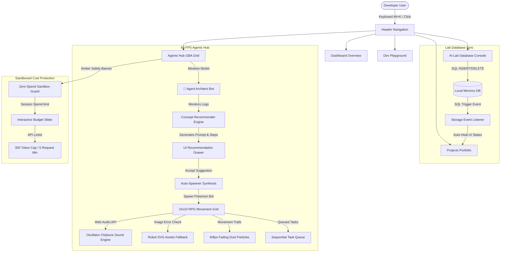

# 🌟 LIN4CRE AI Portal & Game Engine

Welcome to the **LIN4CRE AI Portal**, a premium, gamified developer dashboard and AI simulation ecosystem. This project functions as an interactive workspace console, featuring an offline-first database sandbox, automatic secret synchronization, a keyboard-driven command palette, and a high-resolution 60 FPS Game Boy Advance (GBA) style Pokémon RPG Agent hub.

---

## 🎨 System Architecture

The following Mermaid diagram outlines the pages, controllers, and database event loops operating within this repository:



---

## ✨ Features

### 1. 🏰 High-Resolution RPG Agents Hub
A fully simulated 2D coordinate grid running at 60 FPS that hosts autonomous AI worker agents.
- **Detailed SVG Building Artwork:** Mainframe Node (Cyber Castle Tower 🏰), Git Repository (PokéCenter Clinic 🏥), Database Cluster (Flask Lab 🔬), Edge Server (Windmill Generator ⚡), and Game Corner Cafe (Tudor Tavern 🍻).
- **Web Audio SFX Synth Engine:** zero-dependency oscillator sound synthesizer generating square-wave clicks, level-up arpeggios on job completions, and warning saw-tooth buzzes on errors.
- **Auto-Spawner & Agent Architect:** Mewtwo stands guard, monitoring developer logs to recommend specialized bots (e.g. Scizor for Git, Metagross for Windows PATH, Genesect for DB optimization) complete with detailed prompts and deployment steps. Clicking "Accept Concept" spawns them instantly.
- **Footprint Dust Particles:** State-driven fading walking dust trails behind moving agents.
- **Agent HUD Overlays:** Floating indicators tracking agent Levels (`Lv99`), Simulated Health (`HP`), and real path progress (`EXP`).
- **Retro Dialogue Typewriter:** A scrolling thought dialogue box styled after GBA text menus.

### 2. 📂 Dynamic Projects Hub
- Dedicated full-page briefcase portfolio tab.
- Listens to active local storage event keys. Running simulated SQL database queries in the Lab page automatically updates the project catalog list in real-time, removing placeholders and rendering active database entities.

### 3. 🔍 Command Palette (`Alt + K`)
- Pressing `Alt + K` launches a floating console search modal.
- Provides immediate keyboard routing to all dashboard tabs, settings modules, and logs.

### 4. 🔒 Billing Safety & Zero-Cost Sandbox
- Amber Billing Banner alerts users that no actual LLM tokens can be charged to personal credit accounts.
- Interactive sliding session spend controls cap generative task execution.
- Rate-limiting rules cap local proxy tokens to a maximum of `300 output tokens` and `5 requests per minute`.

---

## 🛠️ Installation & Local Setup

### Prerequisites
- **Node.js** (v18 or higher recommended)
- **Python** (for background environment sweeps)

### 1. Initialize Dependencies
```bash
npm install
```

### 2. Set Up Environment Variables
On initial launch, the system executes `setup_env.py` to compile developer credentials:
- It scans the **Windows Registry** (`HKCU\Environment` and `HKLM\System\CurrentControlSet`) for existing API keys (`GEMINI_API_KEY`, `OPENAI_API_KEY`, etc.).
- It writes them automatically to your local project `.env` file, bypassing manual setup.

### 3. Start Development Servers
Run the dev server:
```bash
npm run dev
```
Open your browser at [http://localhost:5173](http://localhost:5173) to view the portal.

---

## 🚀 Desktop Launcher Integration
Instead of starting servers manually, double-click the compiled C# Windows binary [LIN4CRE_Ecosystem.exe](file:///C:/Users/KingL/Desktop/LIN4CRE_Ecosystem.exe) located on your desktop:
- It launches the PowerShell script `AI_Launchpad.ps1`.
- Automatically tests local gateway connectivity, checks the Docker daemon status, boots active API servers, and loads your browser dashboard.
