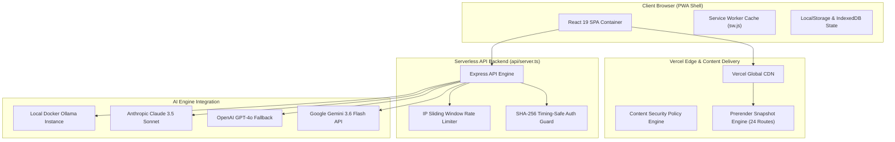

<p align="center">
  
</p>

<p align="center">
  <a href="https://www.linacre.site/"></a>
  
  
  
  
  
  
</p>

---

# 🏛️ linacre.site — Enterprise Developer Portal & Autonomous AI Ecosystem

**linacre.site** is an offline-first developer portal, multi-model AI orchestration lab, and personal software engine engineered by **David Linacre**. Built with React 19, TypeScript, Vite 6, and Express 4, deployed globally across Vercel Edge with zero-downtime static prerendering across all 24 routes.

---

## ⚡ System Architecture



---

## 🌟 Key Application Hubs

- ⚡ **AI Lab (`/lab`):** Unified multi-provider model sandbox with active streaming proxies for Gemini 3.6 Flash, OpenAI, Claude, and local Docker Ollama nodes. Features pre-tuned Quick-Start Engineering Templates (*Code Audit*, *PostgreSQL Schema Designer*, *Regex Builder*, *OpenAPI 3.0 Spec Generator*).
- ✨ **Identity Studio (`/identity`):** Real-time AI prompt emblem generator powered by Gemini 3.6 Flash with dynamic brand palette matching and SVG/PNG vector exports.
- 🧰 **Developer Playground (`/playground`):** Client-side engineering utilities including JSON-to-TypeScript Generator with JSDoc headers, 5-field Cron Expression Explainer & Schedule Builder, JWT Inspector, RegEx Evaluator, and WebAssembly compiler testbed.
- 🤖 **Agents Hub (`/agents`):** Autonomous agent workflow visualizer, step execution simulator, and one-click JSON blueprint exporter for AI agent playbooks.
- 📅 **Discovery Scheduling (`/book`):** Dedicated client route for 15-minute discovery calls and 45-minute architectural review appointments.
- 📊 **Telemetry Dashboard (`/dashboard`):** Real-time service mesh monitoring with accessible text data tables, radar stats, and KeePassXC secret key state verification.

---

## 🔒 Security & Governance

- **Zero Hardcoded Secrets:** Centralized secrets pipeline managed via `linacre.py` CLI and environment variables (`.env`).
- **Timing-Safe Authentication:** Session authentication uses HMAC-SHA256 signatures with constant-time equality comparisons (`crypto.timingSafeEqual`) to mitigate side-channel timing attacks.
- **Strict CSP Headers:** Hardened Content-Security-Policy rules in `vercel.json` enforcing strict script, style, frame, and font origin restrictions.
- **Bounded Rate Limiting:** Sliding-window IP rate limiters on all public API endpoints to prevent brute-force attacks and resource exhaustion.

---

## 🛠️ Local Development & Build Pipeline

### Prerequisites
- Node.js >= 20.x
- npm >= 10.x
- Python 3.11+ (optional for orchestration via `linacre.py`)

### Development Commands
```bash
# Install dependencies
npm install

# Launch development environment (Vite middleware + Express API on port 3000)
npm run dev

# Run TypeScript typechecks & linter
npm run lint

# Build production bundle & prerender static HTML snapshots (24 routes)
npm run build

# Preview production build locally
npm run start
```

### Deployment Command
```powershell
# Automated build and production deployment via Python CLI
python linacre.py build
vercel deploy --prod --yes --project linacre-site-repo --force
```

---

## 👨‍💻 About the Author

**David Linacre**  
*Principal Infrastructure Engineer, DevOps Architect, and Software Systems Developer*

- 🌐 **Live Portal:** [www.linacre.site](https://www.linacre.site)
- 🐙 **GitHub Org:** [@LIN4CRE](https://github.com/LIN4CRE)
- 👤 **GitHub Personal:** [@DLinacre](https://github.com/DLinacre)
- ☕ **Sponsor Craft:** [paypal.me/DLinacre16](https://paypal.me/DLinacre16)

---

## 📄 License
This repository is licensed under the [MIT License](LICENSE).
